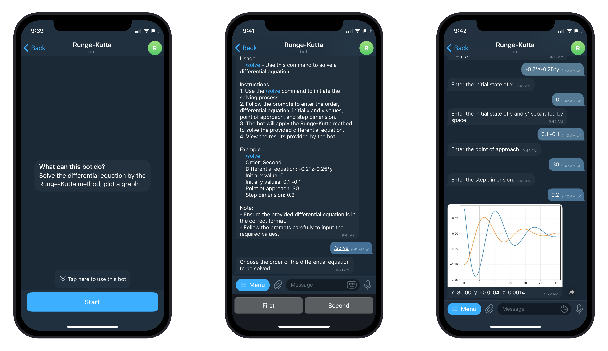

<div align="center">

# Diffy Bot

**A Telegram bot for numerically solving differential equations**

</div>

<p align="center">
  
</p>

<p align="center">
  <em>The user provides an equation and initial conditions — the bot computes the solution using the chosen numerical method and sends back a graph along with a table of values.</em>
</p>

---

## About

Diffy Bot accepts an ordinary differential equation of arbitrary order directly in a Telegram chat, parses it, solves it using one of five numerical methods, and returns the result as a graph plus a text summary. Solution history is saved, so any past computation can be revisited later.

The project consists of three services:

| Service | Role | Stack |
|---|---|---|
| **solver-bot** | Telegram interface: dialogs, equation parsing/validation, plotting | Python, `python-telegram-bot`, `sympy`, `matplotlib` |
| **solver-common** | REST API: numerical methods, storage of requests and results | Java, Spring Boot, Spring JDBC |
| **database** | Stores users, requests (`applications`), and results (`results`) | PostgreSQL |

The bot talks to the server over HTTP, and the server talks to the database via `JdbcTemplate` (plain SQL, no ORM) — all three services come up with a single `docker compose up`.

## Features

- **Equation solving** — first-order and higher-order ODEs with user-defined initial conditions.
- **Numerical methods** — choose from Euler's Method, Midpoint Method, Heun's Method, Runge-Kutta Method, and Dormand-Prince Method.
- **Visualization** — automatic plotting of the solution and its derivatives.
- **Solution history** — every request and result is stored in PostgreSQL and available via the "History" menu.
- **Multilingual support** — interface available in English, Russian, and Chinese (`en`, `ru`, `zh`).
- **User settings** — numerical method, rounding precision, interface language, and hints toggle.

## Architecture

```
Telegram ⇄ solver-bot (Python) ⇄ HTTP ⇄ solver-common (Spring Boot) ⇄ JDBC ⇄ PostgreSQL
```

### API contract

Server REST API (`/api/solver`):

| Method | Path | Purpose | Body / params |
|---|---|---|---|
| `POST` | `/users/{userId}/solve` | Submit an equation for solving | JSON body (`SolverRequest`) |
| `POST` | `/users/{userId}/settings` | Save user settings | Query params: `method`, `rounding`, `language`, `hints` |
| `GET`  | `/users/{userId}/settings` | Get user settings | JSON body (all string fields) |
| `GET`  | `/users/{userId}/applications` | List a user's requests | JSON array |
| `GET`  | `/applications/{applicationId}/status` | Get request status | Plain text (`new` / `in_progress` / `completed` / `error`) |
| `GET`  | `/applications/{applicationId}/results` | Get results for a request | JSON array |

## Quick Start

### Requirements

- Docker
- A Telegram bot token

### Run it

1. Clone the repository

2. Create a `.env` file in the project root using `.env.example`

3. Bring up all services:

   ```bash
   docker compose up --build
   ```

   Once running:
   - The bot responds on Telegram using the provided token;
   - The server API is available at `http://localhost:8081/api/solver`;
   - PostgreSQL is exposed on `localhost:5433`.

4. Message the bot with `/start` and use the menu — **Solve** to solve an equation, **Settings** to change settings, **Solution History** to browse past results.

## Project Structure

```
diffy-bot/
├── solver-bot/             # Telegram bot in Python
│   └── src/
│       ├── telegram_bot/   # Handlers, keyboards, conversation states
│       ├── solver_client/  # HTTP client for solver-common's REST API
│       ├── equation/       # Equation parsing and validation
│       ├── plotting/       # Graph generation
│       ├── formatting/     # Response formatting
│       ├── i18n/           # Localized texts
│       └── config.py       # Bot configuration / defaults
├── solver-common/          # REST server in Spring Boot
│   └── src/main/java/com/solver/
│       ├── web/            # REST controllers + GlobalExceptionHandler (ProblemDetail)
│       ├── service/        # Orchestration: SolverService, ApplicationProcessingService
│       ├── numeric/        # ODE-solving math — framework-free, unit-testable
│       ├── persistence/    # JdbcTemplate repositories (applications, results, settings)
│       ├── dto/            # Immutable records exchanged between layers and over HTTP
│       ├── exception/      # Application-specific exceptions
│       └── config/         # Spring configuration + externalized properties (solver.*)
├── database/
│   └── schema.sql          # PostgreSQL schema (users, applications, results)
├── docs/images/            # Documentation assets
└── docker-compose.yml
```

## Tech Stack

**Bot:** Python 3.13 · python-telegram-bot · SymPy · NumPy · Matplotlib · aiohttp
**Server:** Java 21 · Spring Boot · Spring JDBC (`JdbcTemplate`) · Bean Validation · virtual threads
**Database:** PostgreSQL 17
**Infra:** Docker, Docker Compose

## License

Distributed under the MIT License. See [LICENSE](LICENSE) for more information.